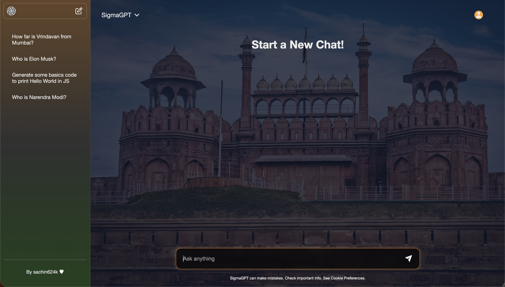
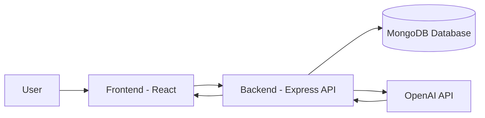
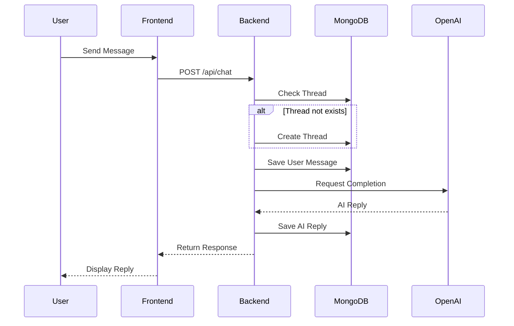
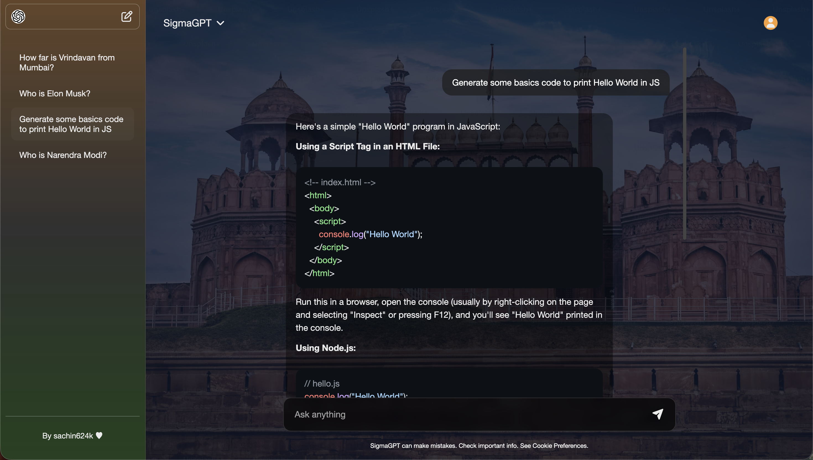

## 🚀 SigmaGPT – Full Stack AI Chat Application
<p align="center">
  
</p>

SigmaGPT is a thread-based AI chat application built using:
- ***Frontend***: React
- ***Backend***: Node.js + Express
- ***Database***: MongoDB
- ***AI Integration***: OpenAI API
It stores chat history and manages conversations using thread architecture.

### 🏗️ System Architecture

**Flow Summary**
- User sends message from frontend
- Backend receives via POST /api/chat
- Backend checks/creates thread
- Saves user message
- Calls OpenAI API
- Saves AI response
- Sends reply back to frontend

### 🗂️ Project Structure
```code
backend/
│
├── models/
│     ├── Thread.js
│     └── Message.js
│
├── routes/
│     └── chat.js
│
├── utils/
│     └── openai.js
│
└── server.js
```
### 🗄️ Database Design
**Thread Schema**
- `threadId`
- `title`
- `messages[]`
- `createdAt`
- `updatedAt`

**Message Schema**
- `content`
- `role` → ("user" | "assistant")
- `timestamp`
Each thread represents one chat session.

### 🔌 API Endpoints
***Get All Threads***
```code
GET /thread
```
***Get Single Thread***
```code
GET /thread/:threadId
```
***Delete Thread***
```code
DELETE /thread/:threadId
```
***Send Message & Get AI Reply***
```code
 POST /chat
Body:
{
  threadId,
  message
}
```

### 🔄 Chat Lifecycle (Sequence Diagram)


### ✨ Features
- Thread-based conversation system
- Persistent chat history
- AI-powered responses
- RESTful API architecture
- Clean modular backend structure
- Markdown support in responses
<p align="center">
  
</p>